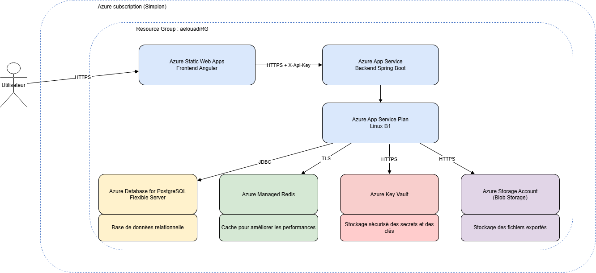

# Azure Quiz - Backend

Backend Spring Boot de l'application **Azure Quiz**, une application permettant de réviser les certifications Microsoft Azure à travers des modules de révision et des examens blancs.

Le backend expose une API REST consommée par le frontend Angular et s'appuie sur plusieurs services Azure : PostgreSQL, Azure Managed Redis, Azure Blob Storage et Azure Key Vault.

L'application est déployée dans un environnement **non-production Azure**.

---

## Stack technique

- Java 21
- Spring Boot 3.5.x
- Maven
- Spring Web
- Spring Data JPA
- PostgreSQL
- Flyway
- Spring Data Redis
- Azure Managed Redis
- Spring Cloud Azure Storage Blob
- Azure Blob Storage
- Azure Managed Identity
- Bean Validation
- Lombok
- Spring Boot Actuator
- springdoc-openapi / Swagger
- JUnit 5
- Mockito
- AssertJ
- GitHub Actions

---

## Architecture applicative

Le backend est hébergé dans une **Azure Linux Web App** utilisant l'**App Service Plan mutualisé fourni dans le cadre de la formation**.

Le frontend Angular est hébergé séparément sur Azure Static Web Apps et communique avec le backend via HTTPS.

Le backend utilise :

- **Azure Database for PostgreSQL Flexible Server** pour les données persistantes ;
- **Azure Managed Redis** pour le cache ;
- **Azure Blob Storage** pour l'export des résultats de quiz ;
- **Azure Key Vault** pour la gestion des secrets et informations sensibles ;
- une **Managed Identity** pour accéder aux ressources Azure lorsque cela est possible.

### Vue simplifiée

```text
                    Internet
                       |
                       v
             Azure Static Web Apps
                Frontend Angular
                       |
                       | HTTPS / REST
                       | X-Api-Key
                       | CORS restreint
                       v
          +--------------------------------+
          | App Service Plan mutualisé     |
          | plan-npr-prf2026               |
          |                                |
          |   Azure Linux Web App          |
          |   Spring Boot - Java 21        |
          |   Backend REST API             |
          +--------------------------------+
                |        |        |
                |        |        |
                v        v        v
          PostgreSQL    Redis    Blob Storage
                                quiz-files

                       |
                       v
                   Key Vault
```

---

## Schéma d'architecture

Le schéma ci-dessous représente l'architecture conçue initialement avant l'implémentation et les ajustements réalisés lors du déploiement Azure.



### Évolution par rapport au schéma initial

L'architecture initialement envisagée prévoyait une isolation réseau plus stricte reposant notamment sur un réseau virtuel, des sous-réseaux et des mécanismes d'accès privés aux ressources Azure.

Lors de l'implémentation, certaines contraintes liées à l'environnement mutualisé de formation et à l'intégration des services managés Azure ont nécessité une adaptation de cette architecture.

L'architecture finalement déployée conserve l'**App Service Plan mutualisé** fourni par le formateur et utilise une Azure Linux Web App pour héberger le backend Spring Boot.

Azure Static Web Apps devant communiquer avec une origine publique dans cette architecture, l'isolation réseau stricte du backend initialement envisagée n'a pas été conservée.

Le contrôle d'accès a donc été renforcé au niveau applicatif avec :

- une politique **CORS limitée à l'origine exacte du frontend Azure Static Web Apps** ;
- une **clé API partagée**, transmise dans l'en-tête `X-Api-Key` et vérifiée par le backend ;
- des règles réseau spécifiques sur les services de données ;
- une Managed Identity et des autorisations RBAC pour l'accès au Blob Storage.

Cette évolution correspond à l'exception prévue dans le cahier des charges pour une architecture basée sur les services managés Azure.

---

## URLs non-production

### Backend

```text
https://app-quiz-backend-aelouadi.azurewebsites.net
```

### Swagger

```text
https://app-quiz-backend-aelouadi.azurewebsites.net/swagger-ui/index.html
```

### Health check

```text
https://app-quiz-backend-aelouadi.azurewebsites.net/actuator/health
```

### Frontend

```text
https://gentle-moss-091704803.7.azurestaticapps.net
```

---

## Fonctionnement de l'application

Le modèle de données principal est :

```text
Certification
     |
     v
Module
     |
     v
Question
     |
     v
Answer Option
```

Une session de quiz est liée à une certification.

En mode révision, elle peut être associée à un module spécifique.

En mode examen, les questions sont sélectionnées parmi les modules actifs de la certification.

Les migrations de base de données sont gérées avec **Flyway** dans :

```text
src/main/resources/db/migration
```

---

## API REST

### Certifications

```http
GET /api/certifications
```

Retourne les certifications disponibles.

### Modules

```http
GET /api/certifications/{certificationId}/modules
```

Retourne les modules d'une certification ainsi que le nombre de questions actives et leur type.

### Création d'une session

```http
POST /api/quiz-sessions
```

Exemple en mode module :

```json
{
  "mode": "MODULE",
  "moduleId": "...",
  "questionCount": 10
}
```

Exemple en mode examen :

```json
{
  "mode": "EXAM",
  "certificationId": "...",
  "questionCount": 40
}
```

La réponse contient les questions et leurs différentes options sans indiquer directement la bonne réponse.

### Répondre à une question

```http
POST /api/quiz-sessions/{sessionId}/questions/{questionId}/answer
```

Retourne notamment le résultat de la réponse ainsi que l'explication associée.

### Résultat

```http
GET /api/quiz-sessions/{sessionId}/result
```

Calcule le résultat final et déclenche également son export vers Azure Blob Storage.

### Export du résultat

```http
GET /api/quiz-sessions/{sessionId}/result/export
```

Permet de télécharger le résultat exporté.

---

## PostgreSQL

La base de données utilise **Azure Database for PostgreSQL Flexible Server** dans l'environnement non-production.

Spring Data JPA est utilisé pour l'accès aux données.

Flyway applique automatiquement les migrations nécessaires au démarrage de l'application.

PostgreSQL reste la source de vérité pour les données et les résultats des quiz.

Les informations de connexion ne sont pas écrites directement dans le code source.

---

## Azure Managed Redis

Azure Managed Redis est utilisé comme cache applicatif.

Il est notamment utilisé pour :

```text
CertificationService.getAllCertifications()
ModuleService.getModulesByCertification()
```

Ces données sont mises en cache avec `@Cacheable`.

Les entrées expirent après 30 minutes.

En local, l'application utilise le conteneur Redis défini dans `docker-compose.yml`.

En Azure, la connexion utilise TLS et les paramètres nécessaires sont injectés dans la configuration de l'App Service.

---

## Azure Blob Storage

Le Storage Account est utilisé pour exporter les résultats des quiz au format JSON.

Le conteneur utilisé dans l'environnement non-production est :

```text
quiz-files
```

Le backend utilise sa **Managed Identity** pour accéder au Blob Storage.

L'identité de l'Azure Web App dispose du rôle Azure approprié sur le stockage, ce qui évite d'utiliser directement une clé du Storage Account dans l'application.

Une indisponibilité temporaire du Blob Storage ne bloque pas le fonctionnement du quiz : PostgreSQL reste la source de vérité.

---

## Sécurité du backend

### CORS

Le backend n'autorise pas arbitrairement toutes les origines.

Dans l'environnement non-production, l'origine autorisée correspond à l'URL exacte du frontend Azure Static Web Apps :

```text
https://gentle-moss-091704803.7.azurestaticapps.net
```

Cette configuration est injectée dans l'App Service par Terraform.

### Clé API

Les appels `/api/**` sont protégés par une clé API partagée.

Le frontend transmet cette clé dans l'en-tête HTTP :

```http
X-Api-Key: <key>
```

Le backend vérifie cette valeur avant d'autoriser l'accès aux endpoints protégés.

La clé API réelle n'est pas écrite en dur dans le code source.

### Managed Identity

L'Azure Linux Web App possède une **System Assigned Managed Identity**.

Elle est notamment utilisée pour accéder au Blob Storage grâce aux autorisations RBAC Azure.

### Secrets

Les secrets ne doivent jamais être committés dans le dépôt Git.

Les informations sensibles sont gérées par la configuration Azure, Terraform et Azure Key Vault.

---

## Variables d'environnement

Les principales variables utilisées dans l'environnement Azure sont :

| Variable | Description |
|---|---|
| `SPRING_PROFILES_ACTIVE` | Active le profil `prod` |
| `SPRING_DATASOURCE_URL` | URL JDBC PostgreSQL |
| `SPRING_DATASOURCE_USERNAME` | Utilisateur PostgreSQL |
| `SPRING_DATASOURCE_PASSWORD` | Mot de passe PostgreSQL |
| `REDIS_HOSTNAME` | Host Azure Managed Redis |
| `REDIS_PORT` | Port Redis |
| `REDIS_PASSWORD` | Clé d'accès Redis |
| `REDIS_SSL_ENABLED` | Active TLS pour Redis |
| `STORAGE_ACCOUNT_NAME` | Nom du Storage Account |
| `STORAGE_CONTAINER_NAME` | Conteneur Blob utilisé pour les exports |
| `BACKEND_API_KEY` | Clé API partagée avec le frontend |
| `APP_CORS_ALLOWED_ORIGINS` | Origine frontend autorisée par CORS |

Ces valeurs sont injectées dans l'Azure App Service par l'infrastructure Terraform.

---

## Exécution locale

### Prérequis

- JDK 21
- Docker
- Maven Wrapper fourni avec le projet

Le projet utilise `spring-boot-docker-compose`.

Un simple :

```bash
./mvnw spring-boot:run
```

permet de démarrer l'application.

Spring Boot détecte le fichier :

```text
docker-compose.yml
```

et peut démarrer automatiquement les services nécessaires au développement local :

- PostgreSQL ;
- Redis ;
- Azurite.

Il est également possible de gérer manuellement les conteneurs :

```bash
docker compose up -d
./mvnw spring-boot:run
```

L'API locale est alors disponible sur :

```text
http://localhost:8080
```

Swagger est disponible sur :

```text
http://localhost:8080/swagger-ui.html
```

---

## Tests

Pour exécuter les tests :

```bash
./mvnw test
```

Le projet utilise notamment :

- JUnit 5 ;
- Mockito ;
- AssertJ.

---

## CI/CD

Le projet utilise **GitHub Actions**.

Les workflows se trouvent dans :

```text
.github/workflows/
```

### Intégration continue

```text
backend-ci.yml
```

Ce workflow réalise les contrôles automatisés du backend.

### Déploiement

```text
backend-deploy.yml
```

Le workflow de déploiement :

1. récupère le code source ;
2. configure Java 21 ;
3. construit l'application avec Maven ;
4. s'authentifie auprès d'Azure avec **OIDC** ;
5. recherche l'Azure App Service à partir de ses **tags Azure** ;
6. déploie le fichier JAR sur l'App Service.

La Web App n'est donc pas identifiée par un nom codé en dur dans le workflow de déploiement.

La recherche s'appuie notamment sur les tags :

```text
Owner = aelouadi
Project = Azure-Quiz
```

---

## Authentification GitHub Actions vers Azure

L'authentification CI/CD utilise **OpenID Connect (OIDC)**.

Les paramètres nécessaires à l'authentification sont enregistrés dans les GitHub Actions Secrets :

```text
AZURE_CLIENT_ID
AZURE_TENANT_ID
AZURE_SUBSCRIPTION_ID
```

Une Federated Credential Azure permet à GitHub Actions de s'authentifier auprès d'Azure sans stocker de client secret Azure permanent dans le dépôt.

---

## Analyse de sécurité

Un workflow dédié est présent :

```text
.github/workflows/security.yml
```

Il exécute **Gitleaks** lors des push et des Pull Requests vers `main`.

Gitleaks analyse l'historique du dépôt afin de détecter d'éventuels secrets ou identifiants accidentellement committés.

---

## Gestion automatique des dépendances

Dependabot est configuré dans :

```text
.github/dependabot.yml
```

Il permet de surveiller les dépendances du projet et de proposer automatiquement leurs mises à jour selon la configuration définie dans le dépôt.

---

## Gouvernance Git

Le dépôt applique plusieurs pratiques de gouvernance :

- commits signés et vérifiés avec le badge GitHub `Verified` ;
- branche `main` protégée ;
- utilisation de Pull Requests ;
- fichier `CODEOWNERS` ;
- Dependabot ;
- scan de secrets avec Gitleaks ;
- CI automatisée.

Le propriétaire par défaut du dépôt est défini dans :

```text
CODEOWNERS
```

---

## Organisation des dépôts

Le projet est séparé en trois dépôts :

```text
bilan-azure-quiz-frontend
bilan-azure-quiz-backend
bilan-azure-quiz-terraform
```

Ce dépôt contient uniquement le **backend Spring Boot**.

Le frontend Angular est développé et déployé depuis son propre dépôt.

L'infrastructure Azure est provisionnée et configurée depuis le dépôt Terraform.

---

## Infrastructure

Le provisionnement des ressources Azure est hors du périmètre de ce dépôt.

Il est géré avec Terraform dans :

```text
bilan-azure-quiz-terraform
```

L'environnement Azure comprend notamment :

- Azure Static Web Apps ;
- Azure Linux Web App ;
- App Service Plan mutualisé ;
- Azure Database for PostgreSQL Flexible Server ;
- Azure Managed Redis ;
- Azure Storage Account ;
- Azure Key Vault ;
- Managed Identity et RBAC ;
- règles réseau nécessaires à la communication entre les différents composants.